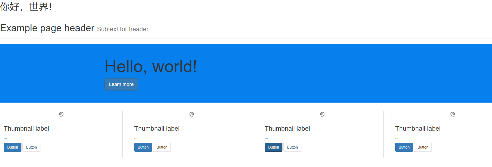
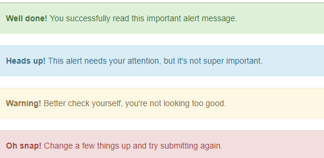

# BootstrapProject

BootstrapProject 实践.

#### 添加依赖和配置
Bootstrap 组件链接
https://v3.bootcss.com/components/#jumbotron


* head标签中添加依赖

```Java
    <meta charset="utf-8">
    <meta http-equiv="X-UA-Compatible" content="IE=edge">
    <meta name="viewport" content="width=device-width, initial-scale=1">
    <!-- 上述3个meta标签*必须*放在最前面，任何其他内容都*必须*跟随其后！ -->

    <!--Bootstrap  从bootstrap导入css-->
        <link href="../bootstrap-3.3.7-dist/css/bootstrap.min.css" rel="stylesheet">
```

* body标签中添加依赖：

```Java

<!-- jQuery (necessary for Bootstrap's JavaScript plugins) 导入jquery -->
<script src="../bootstrap-3.3.7-dist/js/jquery-3.1.1.min.js"></script>
<!-- Include all compiled plugins (below), or include individual files as needed   从bootstrap导入js-->
<script src="../bootstrap-3.3.7-dist/js/bootstrap.min.js"></script>}
```

#### 2、效果展示





<!--

-->


#### 3、核心代码

```Java
<!DOCTYPE html>
<html lang="en">
<head>
    <meta charset="utf-8">
    <meta http-equiv="X-UA-Compatible" content="IE=edge">
    <meta name="viewport" content="width=device-width, initial-scale=1">
    <!-- 上述3个meta标签*必须*放在最前面，任何其他内容都*必须*跟随其后！ -->

    <title>Title template</title>
    <!--Bootstrap  从bootstrap导入css-->
    <link href="../bootstrap-3.3.7-dist/css/bootstrap.min.css" rel="stylesheet">

    <style type="text/css">
        .jumbotron {
            padding-top: 30px;
            padding-bottom: 30px;
            margin-bottom: 30px;
            color: inherit;
            background-color: #0780ed;
        }
        .col-md-4 {
            width: 25%;
        }
    </style>
</head>
<body>
<h1>你好，世界！</h1>
<div class="page-header">
    <h1>Example page header <small>Subtext for header</small></h1>
</div>
<div class="jumbotron">
    <div class="container">
        <div>
            <h1>Hello, world!</h1>
            <p><a class="btn btn-primary btn-lg" href="#" role="button">Learn more</a></p>
        </div>
    </div>
</div>

<div class="row">
    <div class="col-sm-6 col-md-4">
        <div class="thumbnail">
            
            <div class="caption">
                <h3>Thumbnail label</h3>
                <p>...</p>
                <p><a href="#" class="btn btn-primary" role="button">Button</a> <a href="#" class="btn btn-default" role="button">Button</a></p>
            </div>
        </div>
    </div>
    <div class="col-sm-6 col-md-4">
        <div class="thumbnail">
            
            <div class="caption">
                <h3>Thumbnail label</h3>
                <p>...</p>
                <p><a href="#" class="btn btn-primary" role="button">Button</a> <a href="#" class="btn btn-default" role="button">Button</a></p>
            </div>
        </div>
    </div>
    <div class="col-sm-6 col-md-4">
        <div class="thumbnail">
            
            <div class="caption">
                <h3>Thumbnail label</h3>
                <p>...</p>
                <p><a href="#" class="btn btn-primary" role="button">Button</a> <a href="#" class="btn btn-default" role="button">Button</a></p>
            </div>
        </div>
    </div>
    <div class="col-sm-6 col-md-4">
        <div class="thumbnail">
            
            <div class="caption">
                <h3>Thumbnail label</h3>
                <p>...</p>
                <p><a href="#" class="btn btn-primary" role="button">Button</a> <a href="#" class="btn btn-default" role="button">Button</a></p>
            </div>
        </div>
    </div>
</div>
<!-- jQuery (necessary for Bootstrap's JavaScript plugins) 导入jquery -->
<script src="../bootstrap-3.3.7-dist/js/jquery-3.1.1.min.js"></script>
<!-- Include all compiled plugins (below), or include individual files as needed   从bootstrap导入js-->
<script src="../bootstrap-3.3.7-dist/js/bootstrap.min.js"></script>
</body>
</html>
```

